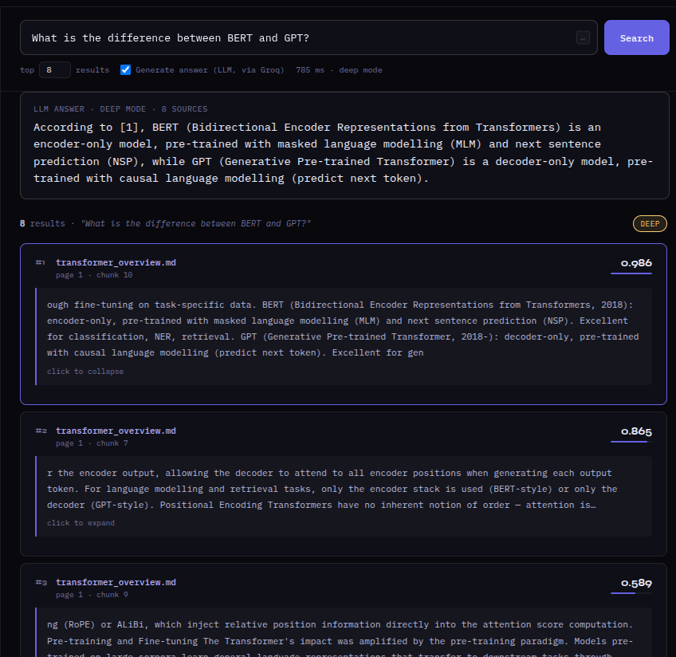

# Document Intelligence RAG

Hybrid document retrieval system combining **BM25s**, **FAISS HNSW** and **CrossEncoder reranking**, evaluated on BEIR benchmarks — extended with an optional **LLM answer generation layer** orchestrated with **LangChain** (Groq) on top of the retrieved/reranked context.


---

## Architecture

```
Query
  │
  ▼
QueryCache ── hit ──────────────────────────────────────── Results
  │ miss                                                      │
  ▼                                                           │
QueryRouter                                                   │
  │                                                           │
  ├─ fast (short / keyword query) ────────────────────────────│
  │     ├─ BM25s (lexical)   ─┐                               │
  │     └─ FAISS HNSW (dense)─┴─ RRF fusion                   │
  │                                                           │
  ├─ deep (analytical query)  ────────────────────────────────┘
  │     ├─ BM25s (lexical)   ─┐
  │     └─ FAISS HNSW (dense)─┴─ RRF fusion ─ CrossEncoder rerank
  │
  ▼
retrieved chunks (with/without rerank)
  │
  ▼
LangChain orchestration (LCEL chain)
format_context → prompt → ChatGroq → answer
  │
  ▼
Answer + cited sources
```

**QueryCache** — two-layer cache: exact LRU match (hash) and semantic near-duplicate detection (cosine similarity). Bypassed in deep mode to always return fresh results.

**QueryRouter** — classifies queries automatically based on length and analytical keywords. Can be overridden explicitly with `fast`, `auto`, or `deep` mode. This is also what decides whether the reranker runs before generation (`deep`) or not (`fast`) — the retrieval/reranking layer stays the existing custom hybrid pipeline; LangChain doesn't touch it.

**Generation layer (`rag/generation`)** — a small LCEL chain (`format_context | prompt | ChatGroq | StrOutputParser`) that takes whatever chunks the retriever/router produced (reranked or not) and turns them into a cited, grounded answer. Generation is optional and fails gracefully: if `GROQ_API_KEY` isn't set, `/api/search` (retrieval-only) keeps working and `/api/ask` returns a clear 503 instead of an error.

---

## Demo



A live demo is available on Hugging Face Spaces. Upload your own PDF, MD, or TXT files, query them with fast or deep retrieval mode, and optionally toggle "Generate answer (LLM)" to get a cited, LLM-written answer on top of the retrieved passages.

👉 https://huggingface.co/spaces/McQbis/document-intelligence-rag

---

## Quick Start

```python
from rag.ingestion.pipeline import IngestionPipeline
from rag.retrieval.embeddings import EmbeddingModel
from rag.retrieval.retriever import HybridRetriever
from rag.routing.router import QueryRouter, RouteMode
from rag.generation import AnswerGenerator

# Ingest
pipeline = IngestionPipeline()
chunks = pipeline.process("document.pdf")   # also .md and .txt

# Build index
emb = EmbeddingModel()
retriever = HybridRetriever(emb)
retriever.build_index(chunks)

# Retrieve (+ optional reranker, depending on mode)
router = QueryRouter(retriever)
results = router.search("What is retrieval-augmented generation?", mode=RouteMode.DEEP)

for chunk, score in results:
    print(f"[{score:.3f}] {chunk.source} — {chunk.text[:120]}")

# Generate a grounded answer from those chunks (requires GROQ_API_KEY)
generator = AnswerGenerator()
answer = generator.generate("What is retrieval-augmented generation?", results)
print(answer)
```

### Generation environment variables

```bash
cp .env.example .env   # then fill in your own GROQ_API_KEY
```

`.env` is loaded automatically on startup (via `python-dotenv`) and is gitignored — never commit it. On Hugging Face Spaces / Cloud Run, the same variables are set as platform secrets instead; `.env` simply doesn't exist there, so nothing changes in the code path.

| Variable | Required | Default |
|---|---|---|
| `GROQ_API_KEY` | for `/api/ask` only | — (get one free at [console.groq.com](https://console.groq.com)) |
| `GROQ_MODEL` | no | `llama-3.1-8b-instant` |

**What happens if the free-tier rate limit is hit:** the Groq call fails, `AnswerGenerator` catches it and `/api/ask` returns `429` with a clear message (`"Groq API rate limit reached (free-tier quota exceeded)..."`) instead of a bare 500 — `/api/search` is unaffected either way, since retrieval and generation are fully decoupled.

---

## API

| Endpoint | Description |
|---|---|
| `POST /api/session` | Create an isolated, in-memory session |
| `POST /api/upload` | Upload a PDF/MD/TXT file into the session index |
| `POST /api/search` | Retrieval only — hybrid search (+ optional reranker), no LLM call |
| `POST /api/ask` | Retrieval (+ optional reranker, per `mode`) **+ LangChain-orchestrated Groq generation** — returns a cited answer plus the source chunks it was grounded on |

`/api/ask` reuses the exact same retrieval/reranking path as `/api/search` (same `mode`: `fast` / `deep` / `auto`); the only addition is the generation step.

| Failure | Response |
|---|---|
| `GROQ_API_KEY` not set | `503` — `/api/search` keeps working unaffected |
| Groq rate limit / quota exceeded | `429` — clear message, suggests retrying or using `/api/search` |
| Groq API key invalid/revoked | `401` |
| No documents indexed yet | `400` |

---

## Installation

```bash
git clone https://github.com/McQbis/document-intelligence-rag.git
cd document-intelligence-rag
python -m venv .venv
source .venv/bin/activate   # Linux / Mac
# .venv\Scripts\activate    # Windows
pip install -e .
```

### Optional — testing, evaluation and finetuning

```bash
pip install -e ".[dev]"
```

---

## Testing

The test suite covers the full stack without loading any real models — all embedding and retrieval components are mocked, so tests run fast and work offline in CI.

- Unit tests — chunking, routing, ingestion pipeline
- API integration tests — session lifecycle, upload limits, search flows

```bash
pytest
```

---

## Evaluation (BEIR)

Offline evaluation on BEIR benchmark datasets. Supports multiple datasets (`fiqa`, `scifact`, `nfcorpus`, `nq`, …) and all retrieval modes.

```bash
python scripts/evaluate.py --dataset scifact --router deep
python scripts/evaluate.py --dataset fiqa --router fast   # no reranker
```

## Finetuning (offline)

Fine-tunes the bi-encoder on BEIR training data using MultipleNegativesRankingLoss. The finetuned model can be passed directly to the evaluator.

```bash
python scripts/finetune.py --dataset fiqa --output-dir models/finetuned
python scripts/evaluate.py --dataset fiqa --model models/finetuned --router deep
```

---

## CI/CD
 
Every push to `main` triggers a GitHub Actions pipeline:
 
1. **Test** — runs the full test suite (`pytest tests/ -v`) with all dependencies mocked, no real models loaded
2. **Deploy** — if tests pass, automatically pushes to HF Spaces
Pull requests only run tests — deploy fires on merge to `main`.
 
---

## Results

| Dataset | Mode | Recall@10 | nDCG@10 |
|---------|------|-----------|---------|
| FiQA | fast (no reranker) | 0.6636 | 0.3533 |
| FiQA | deep (reranker) | 0.6759 | 0.3750 |
| FiQA | finetuned + deep | 0.6775 | **0.3815** |
| SciFact | deep (reranker) | 0.8767 | 0.7293 |
| SciFact | finetuned + deep | 0.9033 | **0.7390** |

👉 **Full report:** [RESULTS.md](RESULTS.md) — includes fast vs deep comparison, finetuning analysis and future work.

---
 
## Known Limitations
 
- **Chunk boundaries can cut mid-word/mid-sentence.** The chunker splits on a fixed size, not on semantic or sentence boundaries, so a retrieved passage occasionally starts or ends mid-word (e.g. "...ough fine-tuning..." instead of "...through fine-tuning..."). This doesn't affect retrieval scoring (which operates on the full chunk), but it can look slightly rough in the UI. A sentence-aware splitter (e.g. respecting `.`/`\n` boundaries) would fix this at the cost of less uniform chunk sizes.
- **Generation is only as grounded as the retrieved context.** The LLM is instructed to answer only from the numbered passages it's given, but with `fast` mode (no reranker) the top-k context can be noisier, which can occasionally lead to thinner or less precise answers than `deep` mode.
- **No conversation memory.** Each `/api/ask` call is independent — there's no multi-turn follow-up handling (e.g. "what about its tokenizer?" referring to the previous question) yet.